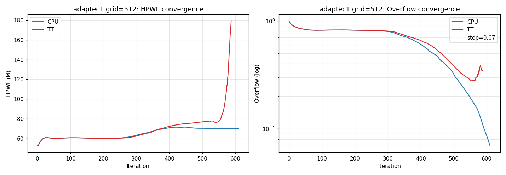
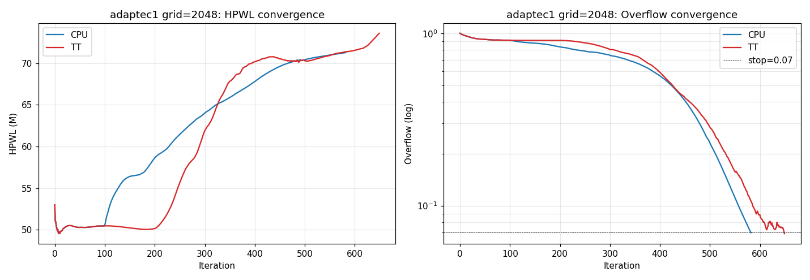
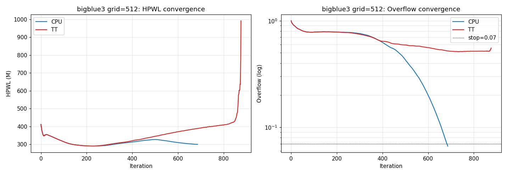
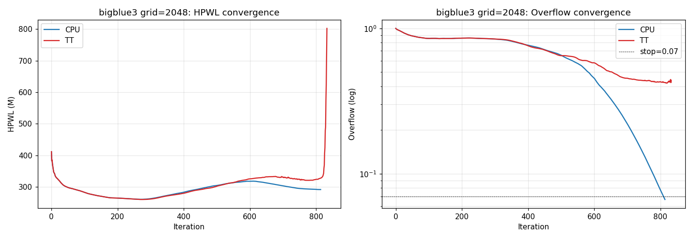

# adaptec1 + bigblue3 sweep results

Steady-state per-iter timings = median over iters ≥100 (post warm-up).

## Pipeline timing breakdown (ms / iter)

| Design | G | nc_max | CPU sc+gth | TT sc+gth | TT scatter | TT gather | TT DCT | TT upload | TT download | TT d2h dens | TT h2d pos |
|---|---:|---:|---:|---:|---:|---:|---:|---:|---:|---:|---:|
| adaptec1 | 512 | 374670 | 7.67 | 9.95 | 3.31 | 6.64 | 0.65 | 0.38 | 0.89 | 0.21 | 0.56 |
| adaptec1 | 2048 | 420805 | 21.24 | 17.87 | 8.89 | 8.98 | 2.29 | 3.37 | 10.87 | 2.61 | 0.62 |
| bigblue3 | 512 | 2045083 | 41.17 | 25.48 | 15.65 | 9.83 | 0.81 | 0.51 | 1.05 | 0.18 | 4.31 |
| bigblue3 | 2048 | 2106136 | 48.54 | 33.27 | 19.05 | 14.22 | 2.28 | 3.37 | 11.34 | 2.69 | 3.49 |

## Final HPWL / Overflow / Iter count

| Design | G | CPU HPWL | TT HPWL | HPWL Δ% | CPU ovf | TT ovf | CPU iters | TT iters |
|---|---:|---:|---:|---:|---:|---:|---:|---:|
| adaptec1 | 512 | 7.028e+07 | 1.793e+08 | +155.09% | 0.07 | 0.35 | 629 | 628 |
| adaptec1 | 2048 | 7.128e+07 | 7.360e+07 | +3.26% | 0.07 | 0.07 | 618 | 771 |
| bigblue3 | 512 | 2.998e+08 | 9.923e+08 | +230.95% | 0.07 | 0.55 | 705 | 898 |
| bigblue3 | 2048 | 2.916e+08 | 8.023e+08 | +175.10% | 0.07 | 0.44 | 826 | 888 |

## Convergence plots

### adaptec1_512

### adaptec1_2048

### bigblue3_512

### bigblue3_2048

